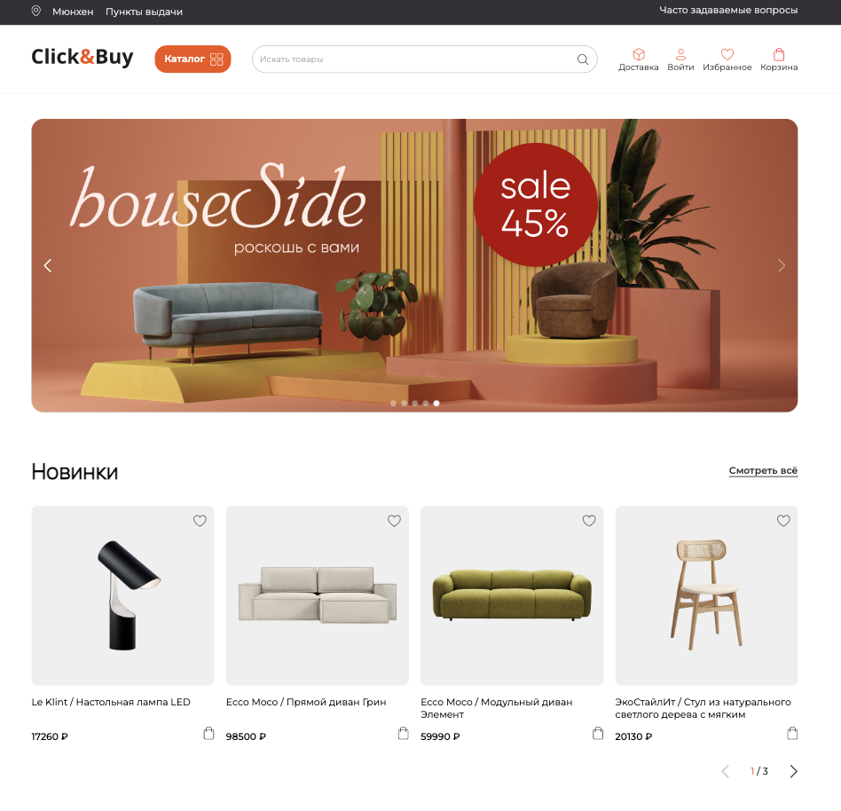
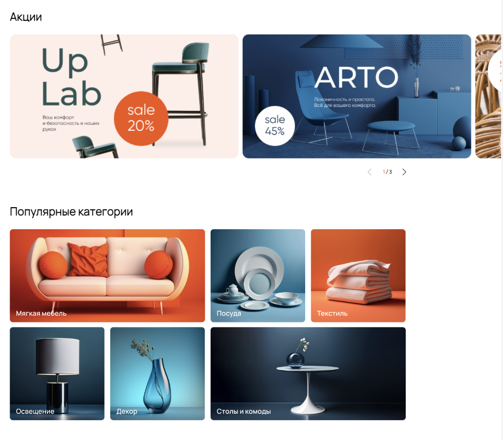
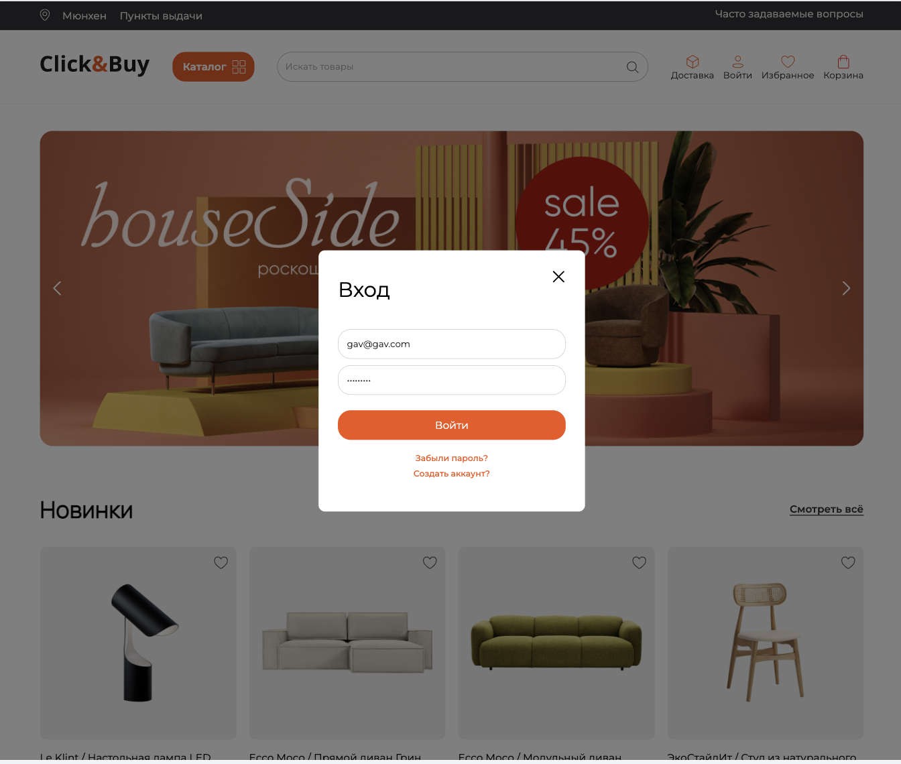
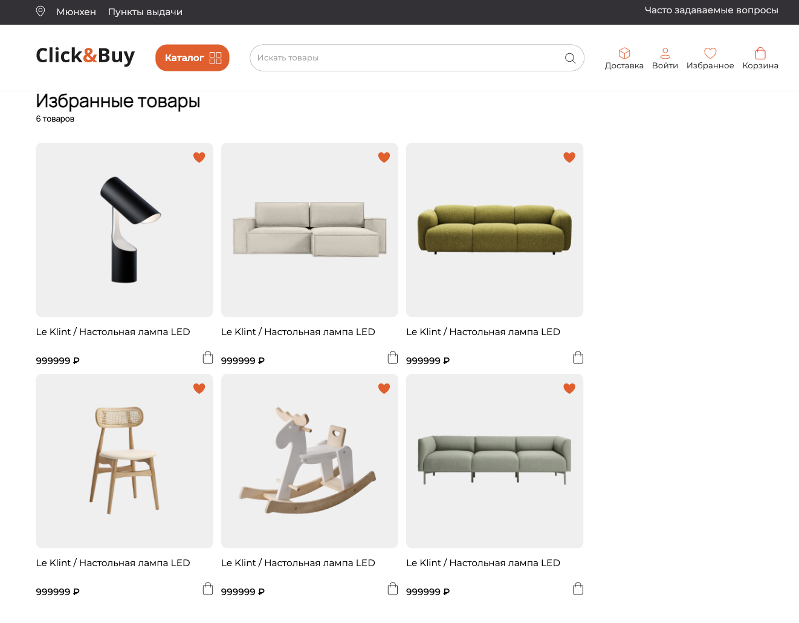
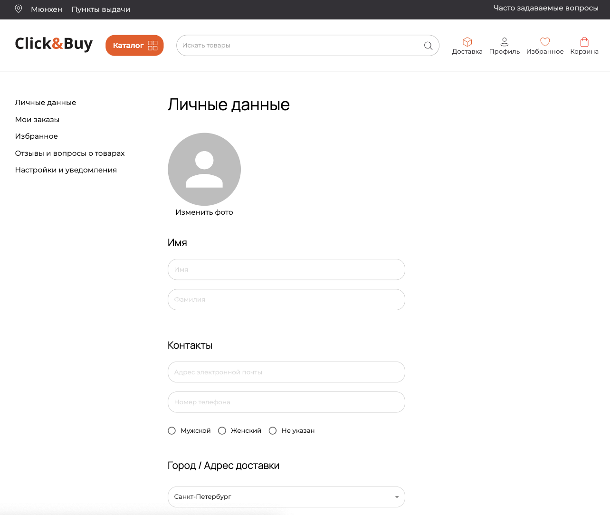
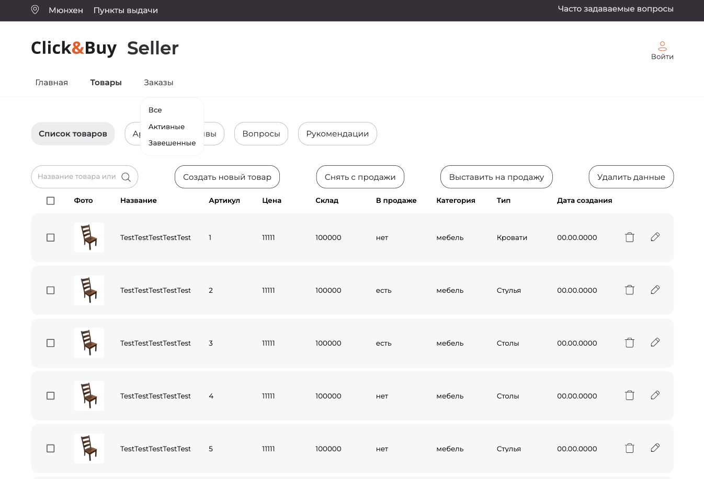
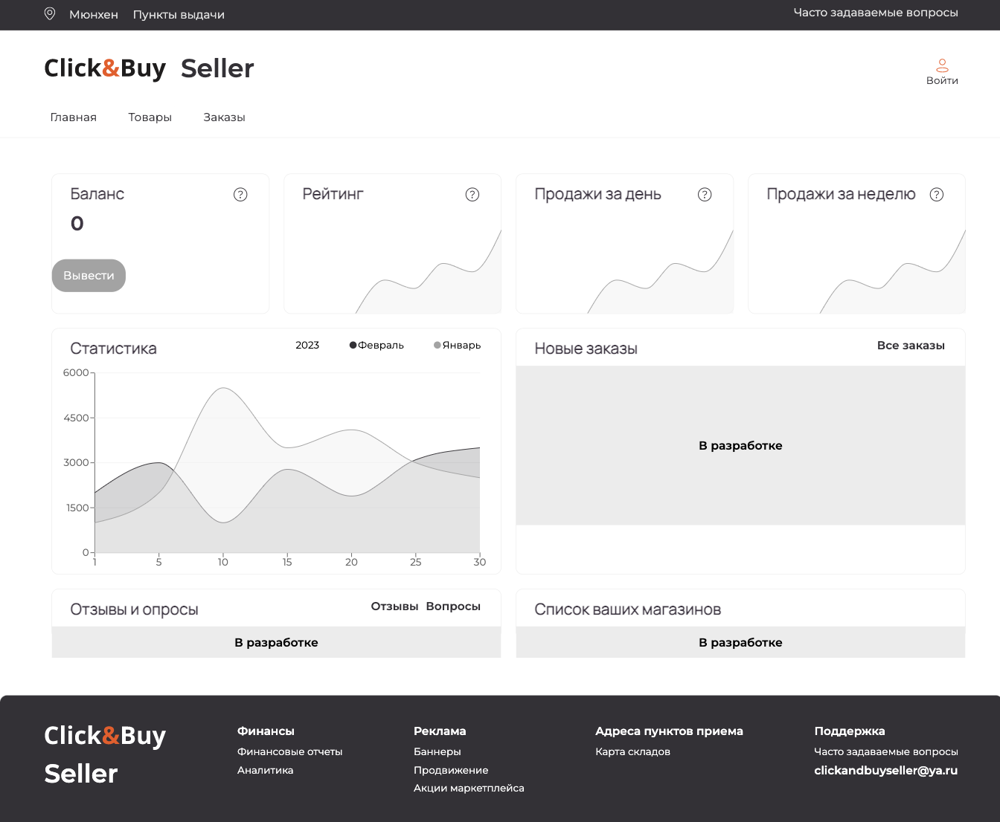

# Click & Buy

Click & Buy is a marketplace for the buyers and sellers of furniture. It is a React-based SPA that fetches data from REST APIs hosted on a Sprinboot server. The app provides registration and authentication services for the buyers and sellers based on Oath2. The buyers and sellers have there personal cabinets where they can change their profile data. Information about the products is fetched from the server and rendered dynamically. The server currently is switched off and only the home page works.

This app was developed as a group pet proejct by a team of junior frontend and backedn developers, UX/UI designers and project managers from the Junior IT Club.

## Features
- E-commerce SPA with registration, authentication and login

## Stack
- Typescript
- React
- Redux
- React-hook-form
- axios
- Material UI
- SCSS
- Swiper
- Stylelint, Eslint
- Git, husky

## Functionality
The screenshots below show some of the implemented features.

The home page of the app:

The campaigns and special offers section:

The login screen of the app:

The favorites of the buyer:

The buyer's cabinet with the profile data:

The seller's cabinet with a list of the seller's products:

The page with the seller's statistical information:
